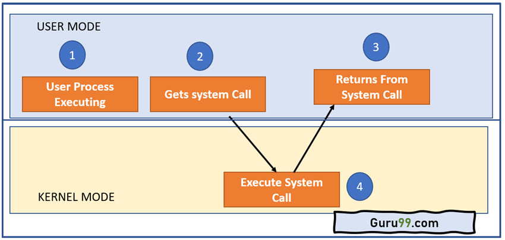
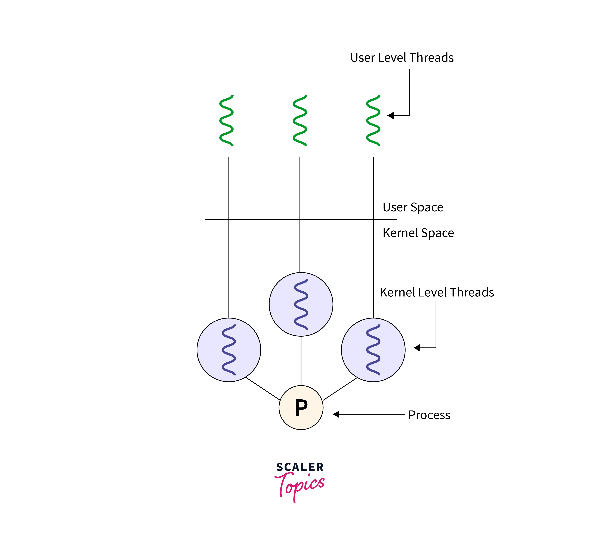
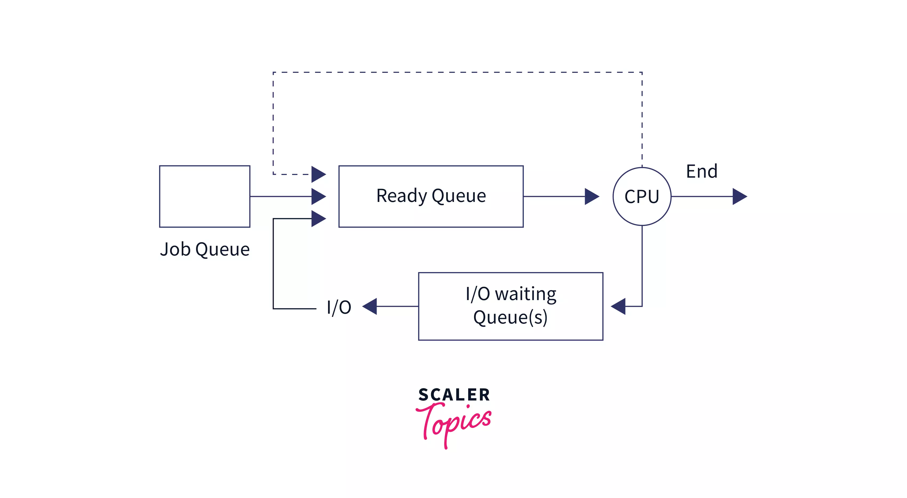
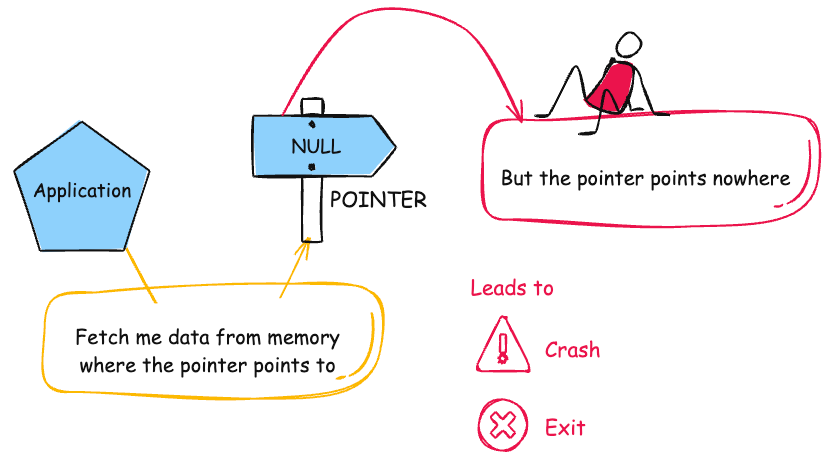
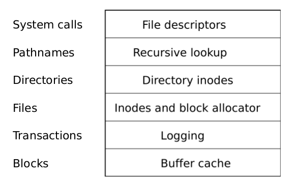

# Operating Systems and System Programming: A Deep Dive into xv6

## Overview

This repository showcases a series of projects developed as part of an Operating Systems course at KAIST, using the xv6 teaching operating system. Each project focuses on enhancing or extending various components of xv6, providing hands-on experience with operating system concepts.

## Projects

### 00. [Introduction to xv6](./Project0-Adding-System-Calls)

*Image sourced from [Guru99](https://www.guru99.com/system-call-operating-system.html)*

Refer to the [project instructions](Project0-Adding-System-Calls/Project0.pdf) to view the list of tasks to be completed.

  
Project Description

  This initial project introduces xv6, a teaching operating system used in the MIT Operating Systems course. The project involved gaining familiarity with the xv6 architecture and adding basic system calls to extend its functionality.

### 01. [Kernel Threading](./Project1-Kernel-Threading)

*Image sourced from [Scaler](https://www.scaler.com/topics/user-level-threads-and-kernel-level-threads/)*

Refer to the [project instructions](Project1-Kernel-Threading/Project1.pdf) to view the list of tasks to be completed.

  
Project Description

  Implemented kernel threading in xv6 by creating kernel threads using `clone()` and `join()` system calls. Additionally, a user-level thread library was developed with functions such as `thread_create()`, `lock_acquire()`, and `lock_release()`.

### 02. [Process Scheduler](./Project2-Process-Scheduler)

*Image sourced from [Scaler](https://www.scaler.com/topics/operating-system/cpu-scheduling/)*

Refer to the [project instructions](Project2-Process-Scheduler/Project2.pdf) to view the list of tasks to be completed.

  
Project Description

  Developed a priority-based process scheduler for xv6. This scheduler assigns different priority levels to processes, ensuring higher-priority processes receive more CPU time compared to those with lower priority.

### 03. [Null Pointer Dereferences and Shared Memory](./Project3-NullPtr-Dereferences-and-Shared-Memory)

*Image sourced from [MITRE CWE](https://cwe.mitre.org/data/definitions/476.html)*

Refer to the [project instructions](Project3-NullPtr-Dereferences-and-Shared-Memory/Project3.pdf) to view the list of tasks to be completed.

  
Project Description

  Enhanced xv6 by adding mechanisms to handle null pointer dereferences, ensuring that any process attempting to dereference a null pointer is terminated immediately. Also implemented shared memory functionality, complete with system calls for managing and tracking shared memory usage across processes.

### 04. [Filesystem Optimization](./Project4-Filesystem-Optimization)

*Image sourced from [UNIX v6/xv6 Book](https://pekopeko11.sakura.ne.jp/unix_v6/xv6-book/en/File_system.html)*

Refer to the [project instructions](Project4-Filesystem-Optimization/Project4.pdf) to view the list of tasks to be completed.

  
Project Description

  Optimized the xv6 filesystem to enhance performance when handling small files. This project involved modifying the filesystem's data structures and algorithms to reduce overhead and improve efficiency for operations involving small files.

## Resources

- [Book of xv6 (PDF)](assets/xv6book.pdf)
- [Operating System Lecture Slides - KAIST (Merged PDF)](assets/EE415_Operating_Systems_Slides_merged.pdf)
- [Course Syllabus](./assets/Syllabus.pdf)

### Note

This project was organized with the aim of demonstrating my past experience with operating systems and their low-level operations, both as a reference for myself and to showcase my skills to potential future employers. Although I uploaded this after graduation, ***the work reflects projects I completed during my master's studies.*** I believe it's important to maintain a well-documented digital footprint, especially since a recruiter once inquired about my experience with low-level concepts.